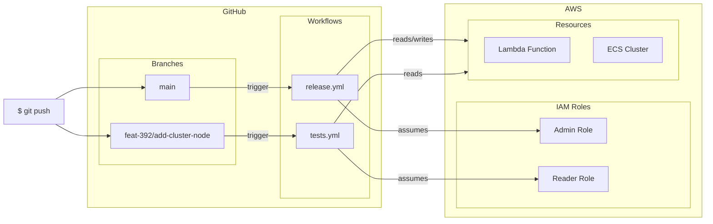
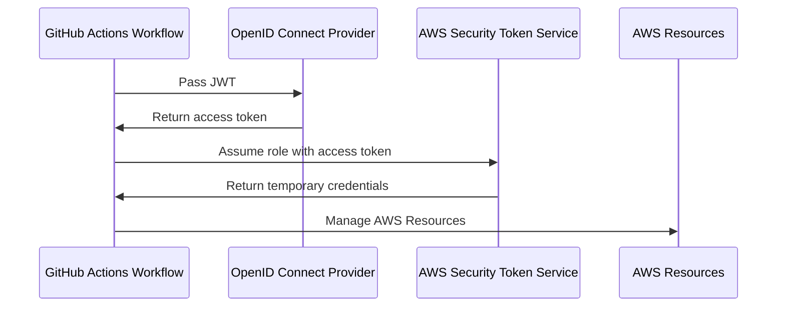

# terraform-github-aws-oidc

Terraform module for configuring authentication between GitHub Actions and AWS, using OpenID Connect.

## Description

This module creates two IAM roles for GitHub Actions workflows to authenticate with AWS using OpenID Connect (OIDC).

The module needs to know the following:
- **GitHub owner, repository name and trunk branch name**: The trunk branch is granted permissions to assume a more permissive IAM role, while non-trunk branches are granted permissions to assume a more restrictive one.
- **S3 bucket name and state files**: The created IAM roles will be granted permissions to read and write to these Terraform state files.
- **IAM policy documents**: The IAM policy documents for the admin and reader roles, which define the permissions required to manage the particular remote resources for the project, such as ECS clusters, Lambda functions, etc.

## Overview

### Role and Workflow Interaction



### Token exchange



<!-- BEGIN_TF_DOCS -->
## Requirements

| Name | Version |
|------|---------|
| terraform | >= 1.11.0 |
| aws | 5.98.0 |
| tls | 4.1.0 |

## Providers

| Name | Version |
|------|---------|
| aws | 5.98.0 |
| tls | 4.1.0 |

## Resources

| Name | Type |
|------|------|
| [aws_iam_openid_connect_provider.github](https://registry.terraform.io/providers/hashicorp/aws/5.98.0/docs/resources/iam_openid_connect_provider) | resource |
| [aws_iam_policy.terraform_state_management](https://registry.terraform.io/providers/hashicorp/aws/5.98.0/docs/resources/iam_policy) | resource |
| [aws_iam_role.admin](https://registry.terraform.io/providers/hashicorp/aws/5.98.0/docs/resources/iam_role) | resource |
| [aws_iam_role.read](https://registry.terraform.io/providers/hashicorp/aws/5.98.0/docs/resources/iam_role) | resource |
| [aws_iam_role_policy.admin](https://registry.terraform.io/providers/hashicorp/aws/5.98.0/docs/resources/iam_role_policy) | resource |
| [aws_iam_role_policy.reader](https://registry.terraform.io/providers/hashicorp/aws/5.98.0/docs/resources/iam_role_policy) | resource |
| [aws_iam_role_policy_attachment.admin_tfstate_mgmt](https://registry.terraform.io/providers/hashicorp/aws/5.98.0/docs/resources/iam_role_policy_attachment) | resource |
| [aws_iam_role_policy_attachment.reader_tfstate_mgmt](https://registry.terraform.io/providers/hashicorp/aws/5.98.0/docs/resources/iam_role_policy_attachment) | resource |
| [aws_partition.this](https://registry.terraform.io/providers/hashicorp/aws/5.98.0/docs/data-sources/partition) | data source |
| [tls_certificate.github](https://registry.terraform.io/providers/hashicorp/tls/4.1.0/docs/data-sources/certificate) | data source |

## Inputs

| Name | Description | Type | Default | Required |
|------|-------------|------|---------|:--------:|
| admin_policy_document | The IAM policy document for the admin role assumed from trunk branch workflows. | ```object({ Version = string Statement = list(object({ Effect = string Action = list(string) Resource = string })) })``` | n/a | yes |
| github | The GitHub configuration used for configuring the OIDC provider. | ```object({ owner = string repo = string trunk_branch = string })``` | n/a | yes |
| name_prefix | The name prefix used for the resources created by this module. | `string` | n/a | yes |
| read_policy_document | The IAM policy document for the reader role assumed from non-trunk branch workflows. | ```object({ Version = string Statement = list(object({ Effect = string Action = list(string) Resource = string })) })``` | n/a | yes |
| tfstate_config | The Terraform state backend configuration, to which the provider will provide access. | ```object({ bucket_name = string state_files = list(string) })``` | n/a | yes |

## Outputs

| Name | Description |
|------|-------------|
| admin_role | The IAM Role used for trunk branch deployments, providing full access to the remote resources. |
| reader_role | The IAM Role used for non-trunk branch deployments, providing read access to the remote resources. |
<!-- END_TF_DOCS -->
